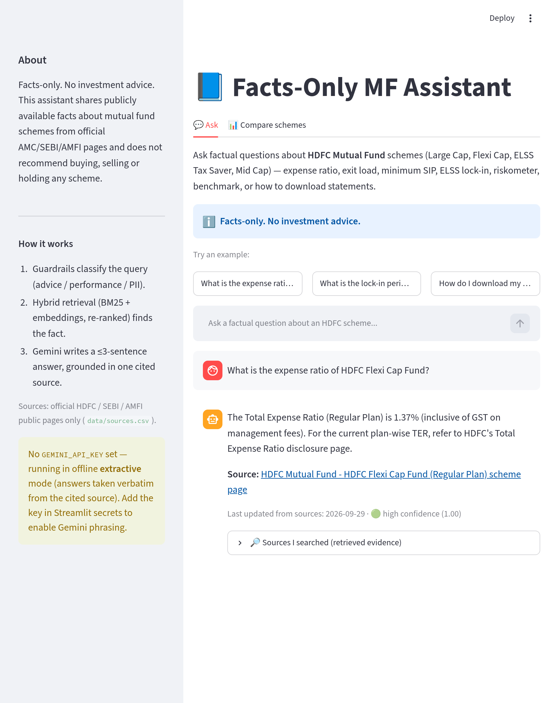
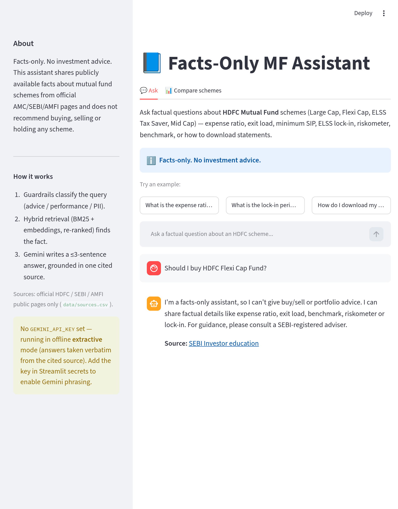
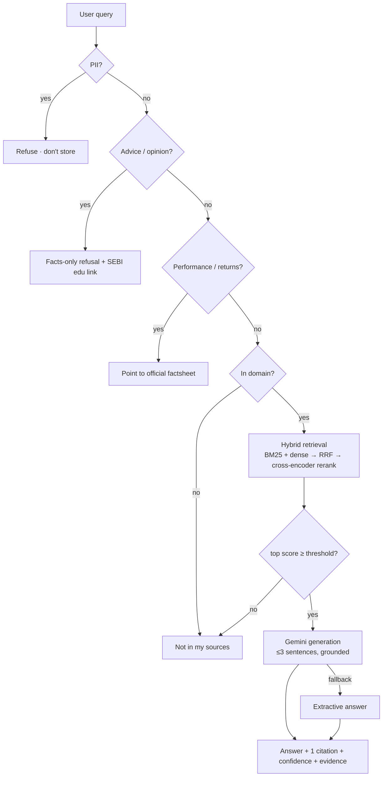
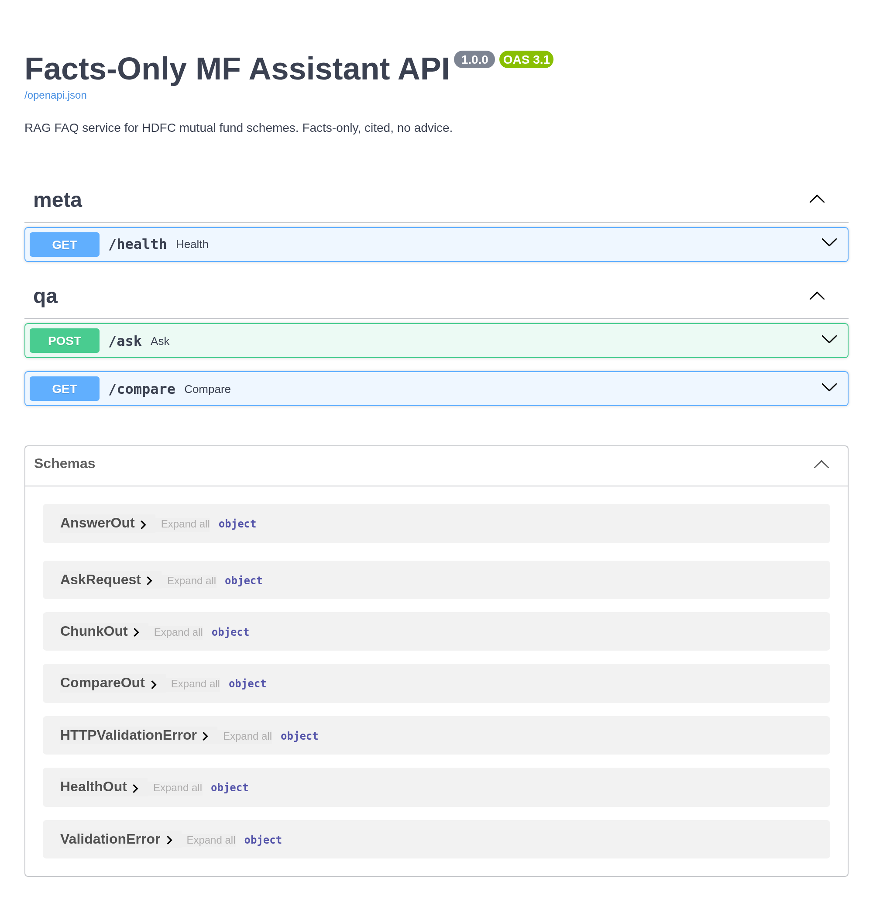

# 📘 Facts-Only MF Assistant

> A production-style **RAG (Retrieval-Augmented Generation)** FAQ assistant that answers
> **factual** questions about HDFC mutual fund schemes using **only official public pages**
> (AMC / SEBI / AMFI). Every answer carries **one citation**. It refuses advice, never makes
> performance claims, and never accepts or stores personal data.


-brightgreen)


> Replace `USERNAME` in the badge/links above with your GitHub username after you push.

**Stack:** Python · **FastAPI** (REST backend) · Streamlit (client) ·
**Hybrid retrieval — BM25 + dense embeddings (sentence-transformers + FAISS) fused with
Reciprocal Rank Fusion + cross-encoder re-ranking** · **Google Gemini** (grounded generation) ·
pytest · ruff · mypy · GitHub Actions · Docker / docker-compose

| Ask (with cited answer + evidence) | Safe refusal |
|---|---|
|  |  |

---

## ✨ Highlights (why this is more than a demo)

- **Advanced hybrid RAG** — combines **BM25 (lexical)** and **dense embeddings**, fuses them
  with **Reciprocal Rank Fusion**, then applies a **cross-encoder re-ranker** for precision.
  Paraphrases work (*"cheapest way to start a monthly plan in mid cap"* → finds the min-SIP
  fact) *and* the cross-encoder cleanly separates in-scope (~1.0) from out-of-scope (~0.0).
- **REST API + client** — a **FastAPI** backend (`/ask`, `/compare`, `/health`, OpenAPI docs
  at `/docs`) with the Streamlit UI as a client; run in-process or against the API.
- **Safety guardrails** — deterministic classifiers refuse **advice**, **performance/returns**,
  and **PII** (PAN, Aadhaar, phone, email, OTP, folio) *before* any retrieval happens.
- **Grounded & cited** — every factual answer shows exactly one official source + a
  "Sources I searched" evidence panel with similarity scores. **100% citation rate.**
- **Evaluated** — a 31-case labelled eval set reports routing / retrieval / refusal /
  citation accuracy; **CI fails if routing accuracy drops below 90%.**
- **Engineered like software** — clean `src/` package, **40 tests (84% coverage)**, typed
  models, **ruff + mypy** gates, pre-commit hooks, Dockerfile + docker-compose, GitHub
  Actions CI, privacy-safe query logging.
- **Degrades gracefully** — works with **no API key** (extractive fallback) and falls back
  hybrid → dense → TF-IDF if a model can't load. It never hard-crashes.

## 📊 Evaluation results

Run `python eval/run_eval.py` (or `make eval`):

| Metric | Score |
|---|---|
| Routing accuracy (right category) | **100%** (31/31) |
| Retrieval accuracy (right source cited) | **100%** (16/16 factual) |
| Refusal accuracy (advice/PII/performance) | **100%** (13/13) |
| Grounded citation rate | **100%** |

## 🧱 Architecture



The pipeline lives in `src/mf_assistant/` and is exposed **two ways**: the Streamlit UI and a
FastAPI service — same logic, different transports.

```
Streamlit UI  ──in-process──▶  Pipeline  ◀──HTTP──  FastAPI (/ask /compare /health)
                                   │
              guardrails → hybrid retrieval → Gemini/extractive generation
```

Maps to the three skills the milestone tests:
- **W1 — Thinking like a model:** the routing (classify → answer vs. refuse) *is* the logic.
- **W2 — LLMs & prompting:** strict system prompt, ≤3-sentence concise answers, safe refusals.
- **W3 — RAG:** small-corpus semantic retrieval with accurate, verifiable citations.

## 🗂️ Project structure

```
mutual-fund-assistant/
├─ app.py                        # Streamlit UI (thin client; in-process or via API)
├─ src/mf_assistant/             # the library (all logic, importable & testable)
│  ├─ config.py                  # central settings & paths
│  ├─ models.py                  # typed Answer / RetrievedChunk / AnswerKind
│  ├─ guardrails.py              # PII / advice / performance / domain detectors
│  ├─ retriever.py               # Hybrid (BM25+dense+RRF+rerank) / dense / TF-IDF backends
│  ├─ generator.py               # Gemini generation + extractive fallback
│  ├─ pipeline.py                # orchestrator: guardrails → retrieve → generate
│  ├─ api.py                     # FastAPI backend (/ask, /compare, /health, /docs)
│  ├─ schemas.py                 # Pydantic request/response models
│  ├─ ingest.py                  # builds & persists the FAISS index (ETL step)
│  └─ logging_util.py            # privacy-safe JSONL query logging
├─ data/
│  ├─ corpus.json                # curated fact chunks (text + source_url + last_updated)
│  ├─ sources.csv                # 22 official AMC/SEBI/AMFI URLs
│  ├─ scheme_facts.json          # structured table for the Compare view
│  └─ index/                     # persisted FAISS index + embeddings + meta
├─ tests/                        # 40 pytest unit + integration + API tests
├─ eval/                         # labelled eval set + metrics harness
├─ scripts/screenshot.py         # regenerate README screenshots
├─ Dockerfile · docker-compose.yml · Makefile
├─ .github/workflows/ci.yml · .pre-commit-config.yaml
└─ requirements.txt · pyproject.toml
```

## 🔌 REST API

Run `make api` (or `uvicorn mf_assistant.api:app --reload`) and open **http://localhost:8000/docs**.



| Method | Path | Description |
|---|---|---|
| `POST` | `/ask` | Answer a factual query (or refuse), grounded in one cited source |
| `GET` | `/compare` | Side-by-side factual comparison table for all schemes |
| `GET` | `/health` | Liveness + active retriever backend + corpus size |

```bash
curl -X POST localhost:8000/ask -H 'Content-Type: application/json' \
     -d '{"query": "exit load of HDFC Mid Cap Fund"}'
```

## 🎯 Scope (corpus)

**AMC:** HDFC Mutual Fund · **Schemes (4):**

| Scheme | Category | Benchmark | Riskometer | TER (Regular) |
|---|---|---|---|---|
| HDFC Large Cap Fund (formerly Top 100) | Large Cap | NIFTY 100 TRI | Very High | 1.57% |
| HDFC Flexi Cap Fund | Flexi Cap | NIFTY 500 TRI | Very High | 1.37% |
| HDFC ELSS Tax Saver | ELSS (tax saver) | NIFTY 500 TRI | Very High | 1.77% |
| HDFC Mid Cap Fund (formerly Mid-Cap Opp.) | Mid Cap | NIFTY Midcap 150 TRI | Very High | 1.31% |

Plus SEBI/AMFI concept pages (expense ratio, riskometer, ELSS lock-in) and HDFC
statement/capital-gains guides. Full corpus: [`data/corpus.json`](data/corpus.json);
all 22 URLs: [`data/sources.csv`](data/sources.csv) (also listed at the bottom).

## 🚀 Quickstart

```bash
git clone https://github.com/USERNAME/mutual-fund-assistant.git
cd mutual-fund-assistant
pip install -e ".[dev]"        # or: pip install -r requirements.txt

# optional — enables Gemini phrasing (free key: https://aistudio.google.com/app/apikey)
export GEMINI_API_KEY="your-key"

make ingest                   # build the FAISS index (optional; app builds one at startup)
make run                      # Streamlit UI  -> http://localhost:8501
make api                      # FastAPI docs  -> http://localhost:8000/docs
```

Other commands: `make check` (lint + types + coverage + eval — what CI runs) ·
`make test` · `make eval` · `make lint` · `make typecheck` · `make compose`.

### Run with Docker
```bash
docker build -t mf-assistant .
docker run -p 8501:8501 -e GEMINI_API_KEY=$GEMINI_API_KEY mf-assistant

# or run the API + UI together:
docker compose up --build      # UI :8501 (talks to API :8000)
```

### Deploy free on Streamlit Community Cloud
1. Push to a **public GitHub repo**.
2. https://share.streamlit.io → **New app** → select the repo + `app.py`.
3. **Advanced → Secrets:** `GEMINI_API_KEY = "your-key"`.
4. Deploy → share the `*.streamlit.app` URL as your working-prototype link.

## 🧪 Testing, quality & evaluation

- **Tests:** `pytest --cov` → **40 tests, 84% coverage** (guardrails, retrieval contract,
  pipeline routing, API endpoints, privacy: PII never echoed).
- **Lint & types:** `ruff check` + `mypy` (both clean); `.pre-commit-config.yaml` runs them
  on every commit.
- **Eval harness:** `python eval/run_eval.py` prints the accuracy report and exits non-zero
  if routing accuracy < 90%.
- **CI:** GitHub Actions runs lint → types → tests+coverage → eval on every push/PR.

## 🔒 Safety & privacy design

- **No advice / no performance** — refused by pattern classifiers with polite, on-brand copy.
- **No PII** — detected and refused *before* logging; a PII query is stored as
  `[REDACTED_PII]`, never echoed back.
- **Public sources only** — no third-party blogs, no back-end scraping.
- **Transparency** — one citation per answer + "Last updated from sources: 2026-09-29".

## 📚 Source list (22 official URLs)

<details><summary>Click to expand</summary>

**AMC — HDFC Mutual Fund**
1. HDFC Large Cap Fund — Regular: https://www.hdfcfund.com/product-solutions/overview/hdfc-top-100-fund/regular
2. HDFC Large Cap Fund — Direct: https://www.hdfcfund.com/product-solutions/overview/hdfc-top-100-fund/direct
3. HDFC Flexi Cap Fund — Regular: https://www.hdfcfund.com/explore/mutual-funds/hdfc-flexi-cap-fund/regular
4. HDFC Flexi Cap Fund — Direct: https://www.hdfcfund.com/explore/mutual-funds/hdfc-flexi-cap-fund/direct
5. HDFC ELSS Tax Saver — Regular: https://www.hdfcfund.com/explore/mutual-funds/hdfc-elss-tax-saver/regular
6. HDFC ELSS Tax Saver — Direct: https://www.hdfcfund.com/explore/mutual-funds/hdfc-elss-tax-saver/direct
7. HDFC Mid Cap Fund — Regular: https://www.hdfcfund.com/explore/mutual-funds/hdfc-mid-cap-fund/regular
8. HDFC Mid Cap Fund — Direct: https://www.hdfcfund.com/explore/mutual-funds/hdfc-mid-cap-fund/direct
9. SID — HDFC Flexi Cap Fund: https://files.hdfcfund.com/s3fs-public/SID/2025-05/SID%20-%20HDFC%20Flexi%20Cap%20Fund%20dated%20May%2030,%202025.pdf
10. SID — HDFC ELSS Tax Saver Fund: https://files.hdfcfund.com/s3fs-public/SID/2024-11/SID%20-%20HDFC%20ELSS%20Tax%20Saver%20Fund%20dated%20November%2021,%202024.pdf
11. KIM — HDFC Mid-Cap Opportunities Fund: https://files.hdfcfund.com/s3fs-public/KIM/2024-11/KIM%20-%20HDFC%20Mid-Cap%20Opportunities%20Fund%20dated%20November%2021,%202024.pdf
12. Scheme Summary — HDFC Top 100 Fund: https://files.hdfcfund.com/s3fs-public/2023-06/HDFC%20Top%20100%20Fund.pdf
13. Total Expense Ratio — Notices: https://www.hdfcfund.com/statutory-disclosure/total-expense-ratio-of-mutual-fund-schemes/notices
14. Total Expense Ratio — Reports: https://www.hdfcfund.com/statutory-disclosure/total-expense-ratio-of-mutual-fund-schemes/reports
15. Consolidated Account Statement (CAS): https://www.hdfcfund.com/services/consolidated-account-statement
16. How to get a Capital Gain Statement: https://www.hdfcfund.com/learn/blog/how-get-capital-gain-statement-mutual-fund-schemes-india
17. Investor Services: https://www.hdfcfund.com/investor-services

**AMFI**
18. Knowledge Center — Expense Ratio (TER): https://www.amfiindia.com/investor/knowledge-center-info?zoneName=expenseRatio
19. Investor Corner: https://www.amfiindia.com/investor

**SEBI**
20. SEBI Investor — Riskometer: https://investor.sebi.gov.in/riskometer.html
21. SEBI Investor — Guide to ELSS: https://investor.sebi.gov.in/elss.html
22. TER & Performance Disclosure Circular: https://www.sebi.gov.in/legal/circulars/oct-2018/total-expense-ratio-ter-and-performance-disclosure-for-mutual-funds_40766.html

</details>

## 💬 Sample Q&A

See [`sample_qa.md`](sample_qa.md) for 12 worked examples (8 factual + 4 refusals).

## ⚖️ Disclaimer

> **Facts-only. No investment advice.** This assistant shares publicly available facts about
> mutual fund schemes from official AMC/SEBI/AMFI pages. It does not recommend
> buying/selling/holding any scheme, does not compute or compare returns, and never accepts
> or stores PII. Figures (esp. TER) change over time — verify against the linked source.
> Mutual fund investments are subject to market risks; read all scheme related documents
> carefully. For personalised guidance, consult a SEBI-registered adviser.

## ⚠️ Known limits

- Small curated corpus (4 HDFC schemes + core concepts); out-of-scope queries are declined.
- Facts compiled from official pages on **2026-09-29**; the app links each source so the
  latest value can be verified (and points to HDFC's live TER page for current ratios).
- Regular-plan TER shown by default (Direct differs — see the TER page).
- No live NAV / performance by design. No transactions, no login, no PII.

## 📄 License
MIT — see [`LICENSE`](LICENSE).
